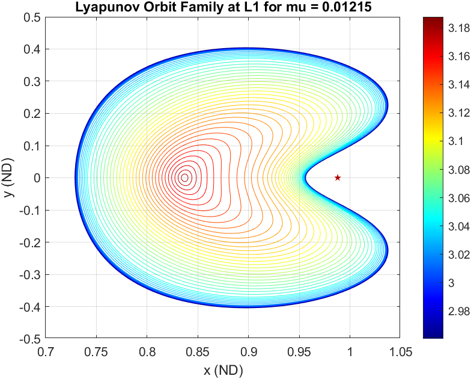
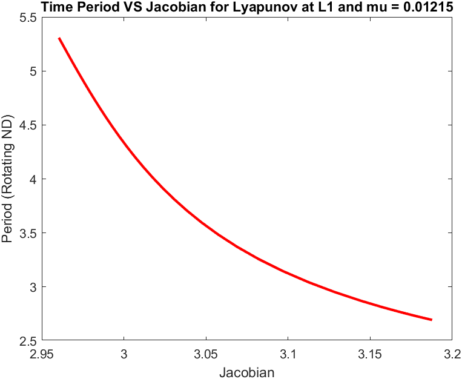
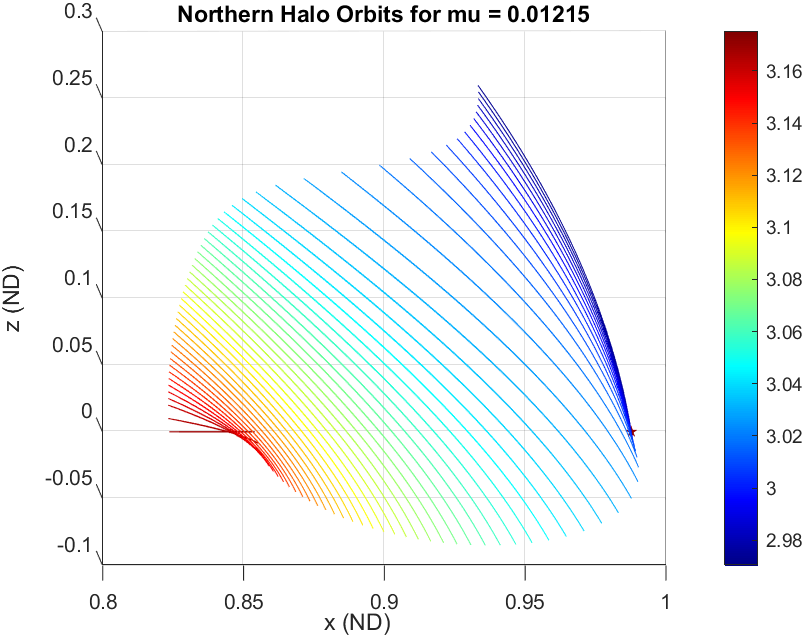
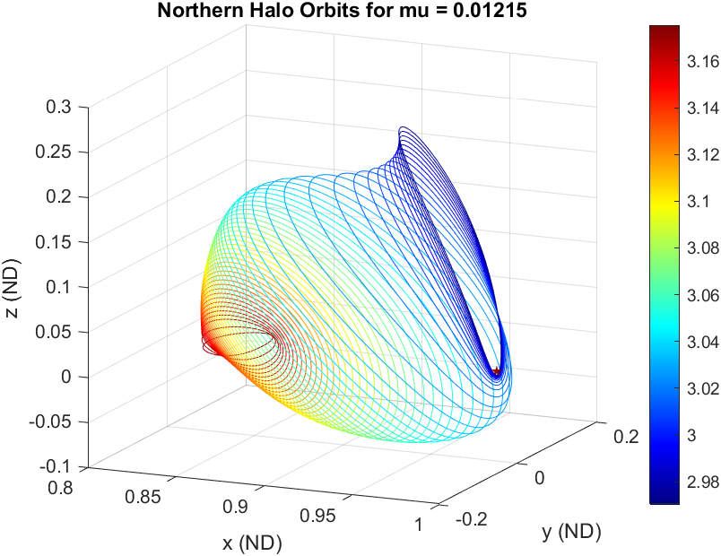
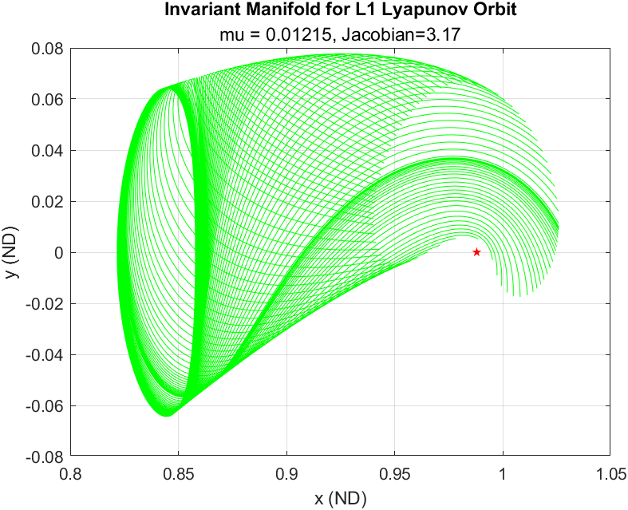

# CRTBP-Library

This code serves as a matlab Library for non-dimensional CRTBP System. Obtains: Lyapunov Orbit and Halo Orbit Parameters. Future Updates: Functions for all symmetric and asymmetric orbits (given in Daniel Grebow's Master's thesis) , Invarient Manifold functions, Resonant Orbit Functions (as in Manninie Gupta's Master's Thesis) and more. Invarient Manifold Code can be found in 3-Body_Problem Code.


## Functions

Make use of following functions:

* `LyapOrbitParameters.m` gives the Initial Conditions and other parameters (time period, Eigen Structure, Stability Index etc.) in the non-dimentinal CR3BP of a lyapunov orbit for spacific mu, liberation point and jacobian.
* `LyapOrbitFamilyParameters.m` gives the Initial Conditions and other parameters (time period, Eigen Structure, Stability Index etc.) in the non-dimentinal CR3BP of family of lyapunov orbits for spacific mu and liberation point.
* `HaloOrbitParameters.m` gives the Initial Conditions and other parameters (time period, Eigen Structure, Stability Index etc.) in the non-dimentinal CR3BP of a Halo orbit (northern and Southern should be specified) for spacific mu, liberation point and jacobian.
* `HaloOrbitFamilyParameters.m` gives the Initial Conditions and other parameters (time period, Eigen Structure, Stability Index etc.) in the non-dimentinal CR3BP of family of Halo orbits (northern and Southern should be specified) for spacific mu and liberation point.
* `PeriodicOrbitInvariantMfdsIC.m` returns the Initial Conditions to compute Invariant Manifolds (Stable+/-, Unstable+/-) for a given Periodic Orbit. The direction needs to be taken care of!
* `Integrator.m` make use of this fucntion to compute the final Periodic Orbits

## Examples

Inputting System Variables

```ruby 
userInput.Dimension      = 3;   % 2/3
userInput.mu        = 0.0121505856; % system Parameter
userInput.lagrangePt       = 1; % lagrange Point
userInput.orbitCount  = 10; % No. of Orbits in the family
userInput.plotDiffCorrec = 1;   % Is Differential Correction Plotted (0/1)
userInput.orbit          = 'halo';  % which Orbit
userInput.type           = 'northern';  % 'northern'/'southern' for 'halo' else 'none'
userInput.tolerance      = 1e-6;    % solution tolerance
userInput.jacobianConst  = 3.1; % Required jacobian Constant
globalVar                  = GlobalData(userInput);
```

- `userInput.lagrangePt` specifies which equilibrium points you want the data for? can take 1,2,3 for now
- `userInput.plotDiffCorrec` can take 1 and 0 specifying if you want differential correction plots or not.

```ruby
plotOrbit(globalVar)
```

### Example:1 Plotting Lyapunov Orbit Family


```ruby
plotFamily(globalVar)

```

You can also carry out the Jacobian and Time Period Analysis

Similarly you can carry out a Stability Analysis using Stability Index.

### Example:2 Plotting Halo Orbit Family




### Example:3 Plotting Invariant Manifolds

```ruby
plotInvManifold(globalVar)
```



## References Used


    - Dynamical Syatems, the three-body problem and Space Mission Design, Koon, Lo, Marsden, Ross
    - Generating Periodic Orbits In CR3BP With Applications To Lunar South Pole Coverage - Daniel Grebow
    - Finding Order in Chaos: Resonant Orbits and Poincare Section - Maaninee Gupta
    - TADPOLE ORBITS IN THE L4/L5 REGION: CONSTRUCTION AND LINKS TO OTHER FAMILIES OF PERIODIC ORBITS - Alexandre G. Van Anderlecht
    - SPACECRAFT TRAJECTORY DESIGN TECHNIQUES USING RESONANT ORBITS - Srianish Vutukuri
    - REPRESENTATIONS OF INVARIANT MANIFOLDS FOR APPLICATIONS IN SYSTEM-TO-SYSTEM TRANSFER DESIGN - Christopher E. Patterson

## More to Come...

More to be added :

* Halo Orbit for L3
* Vertical Orbit (L1/2/3/4/5)
* Axial Orbit (L1/2/3/4/5)
* Butterfly (L2/?)
* Planar (L4/5)
* Tadpole Orbit, Horseshoe Orbit (L4/5)
* Resonant Orbits
* Bifurcations and More...
